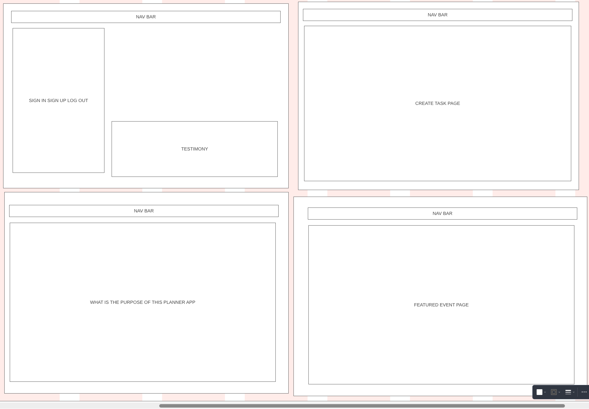
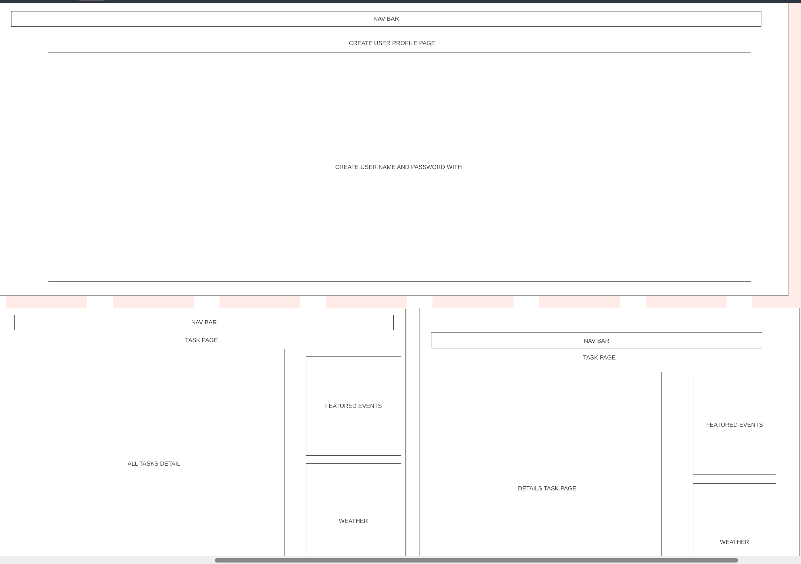
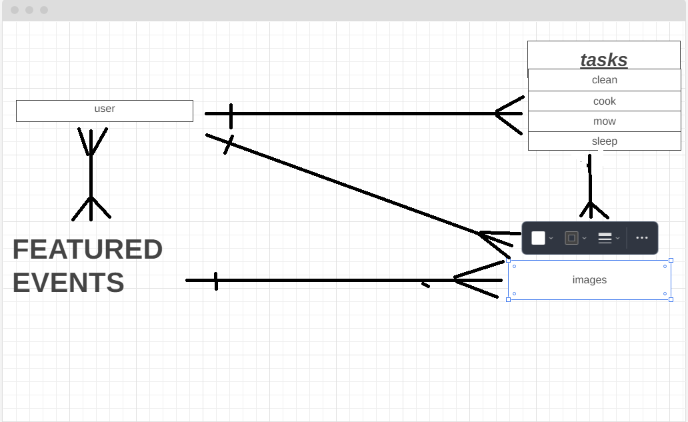

# all_purpose_planner

## Purpose for App
The purpose of this life planner is to organize daily task through your life. You will be able to login and logout. Create your own profile/user and edit it. You will be able to CRUD task. The user will be able to view all task and then click each task to view them, edit, delete. The app will have a home page that show how people have used this app and how it has helped them in life. The about page will have details on how to use this app. There will be a featured events page that you can click on to add to the task you want. There will be a weather section that once you put your zip code in you will see the weather forcast. You will be able to add photos to your tasks that will be displayed in the cards in both the view all and individual detail. 

## As A User (wants)
- AAU I want to create task
- AAU CRUD task
- AAU I want to add featured events to page to go to only to READ
- AAU I want to view the pages of task, events, profile, details of task
- AAU I want a navigation to how to use page
- AAU I want login/logout 
- AAU have a sign up page
- AAU I want a weather section to see how the weather will be on certain days in certain locations
- AAU I want a navigation bar to travese the pages
- AAU add photos to tasks
- AAU I want a page for how to use the app
- AAU I want a page that shows testmony of the app
- AAU I want to have the planner track task for individual
- AAU I want the tracker to remind | ALERT when prior and on time of set date/time
- AAU I want to be able to edit profile | reset password

## Over all Data set layout
CRUD
- First Data set (User) OneofMany
    User | djano
    username
    first_name
    last_name
    password
    email

CRUD
- Second Data set (Daily Tasks) OnetoMany
    - name = user REQUIRED
    - date changeable future and know REQUIRED
    - time crud
    - task/description of task / crud REQUIRED
    - tracker / reminder /alert

Select event ONLY
- Thrid Data set (Featured Events) ManytoMany
    - name
    - date/time
    - location = (state, city, address)
    - VP (user can filter order)

CRUD (MVP)
- Fourth Data set (Photo) ManytoMany
    - url (AWS | S3/IAM)
    - task (ForgienKey)

(MVP)
- Fifth Data set (Weather)
    - url (API)

## General lay out of HTML pages
- Main pages
    - home.html
    - about.html
    - base.html

- User | Profile pages
    - profile.html
    - create_profile.html
    - create_user.html
    - edit_user.html

- Task pages
    - create_task.html
    - index.html
    - Details/edit/delete_task.html | add photo | preview of featured events | weather API if post MVP

- Featured Events pages
    - feature_events.html

## MVP 
- API (Tailwind)
- API 3rd party weather
- API geo for events

# Wireframe

# ERD

# Trillo
[Trillo planner page](https://trello.com/b/NBZibZ95/planner)

# Project Pitch
[Download PDF](/All%20Purpose%20PlannerPitch.pdf)

# Tools we used:
- Django
- psql
- HTML
- APIs
- JavaScript
- CSS
- Materialized
- Python
- ChatGPT

# Credits
- [Materialized](https://materializecss.com/grid.html)
- [How to Drop a Database](/https://www.google.com/search?q=postgresql+drop+database+command+line&sca_esv=5d0811d5ae0715ef&rlz=1C1VDKB_enUS945US945&biw=1214&bih=1288&tbm=vid&ei=iewnZvOhF8rGp84Py5qlgA0&ved=0ahUKEwizio2I69iFAxVK48kDHUtNCdAQ4dUDCA0&uact=5&oq=postgresql+drop+database+command+line&gs_lp=Eg1nd3Mtd2l6LXZpZGVvIiVwb3N0Z3Jlc3FsIGRyb3AgZGF0YWJhc2UgY29tbWFuZCBsaW5lMggQABiABBiiBDIIEAAYgAQYogQyCBAAGIAEGKIESJMCUABYAHAAeACQAQCYAVygAVyqAQExuAEDyAEA-AEBmAIBoAJfmAMAkgcBMaAHuAI&sclient=gws-wiz-video#fpstate=ive&vld=cid:9b08efbc,vid:S26jetR0M8I,st:0)
- GA Canavas Modules
- GA Previously built projects
- ChatGPT (fixing problems that we could not see)

